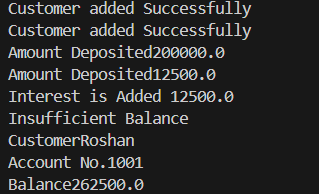

# Bank Management System (Java)

A console-based banking system with Savings and Current account logic, interest calculation, overdraft handling, and customer management.

## Features
- Savings & Current accounts
- Interest calculation
- Add users
- Show the details of the user 
- Overdraft logic
- Customer management
- OOP principles: inheritance, encapsulation, method overriding

## How to Run
Compile and run `BankManagementSystem.java` in any Java IDE or terminal.
## 📸 Sample Output

## Author
Roshan — BCA student 
